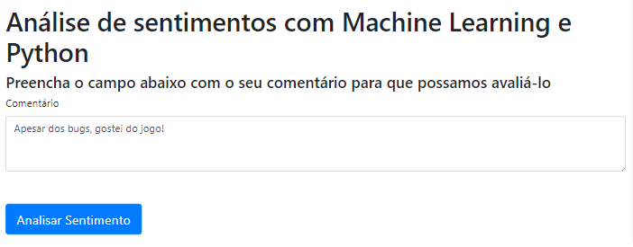

# Análise de sentimento de cliente com Machine Learning e Python 

> Análise de sentimentos com Machine Learning e Python

Este projeto utiliza um modelo de **Regressão Logística** do _sickit-learn_, previamente treinado com um _dataset_ pequeno de _reviews_ de clientes acerca do jogo Cyberpunk 2077, coletado na plataforma da Amazon. Comentários com ao menos 3 estrelas são classificados como **Bom**, caso contrário **Ruim**. O projeto consome o modelo via API, utilizando a biblioteca ```FastAPI``` para Python.



###### Descrição dos arquivos no diretório

* ```api.py``` contém a API de requisição e processamento do modelo.
* ```comunicacao.php``` arquivo responsável por fazer a requisição à API e mostrar o resultado formatado, de acordo com a resposta do modelo.
* ```home.php``` arquivo com o HTML da página principal.
* ```inferencia.py``` arquivo Python contendo funções para transformação de texto e inferência do modelo.
* ```modelo.joblib``` binário do modelo previamente treinado.
* ```transformer.joblib``` binário do objeto necessário para transformar o texto em vetor de características, utilizando ```tf-idf```.

## Instalação de dependências

Linux & Windows:

```sh
pip install numpy
pip install scikit-learn
pip install fastapi
pip install joblib
```

## Exemplo de uso
Inicie o servidor PHP (com o XAMPP, por exemplo), o qual irá abrir a página ```home.php```. 

Posteriormente, deve-se inicializar o servidor da API, utilizando:

```sh
uvicorn api:app --reload
```

Para utilizar o sistema, basta digitar um comentário no campo ```Comentário```, como por exemplo ```"Apesar dos bugs, gostei do jogo!"```. O sistema fará uma requisição à API que irá processar o comentário e retornar a classificação do modelo como Bom ou Ruim, mostrando o resultado em uma página HTML.

